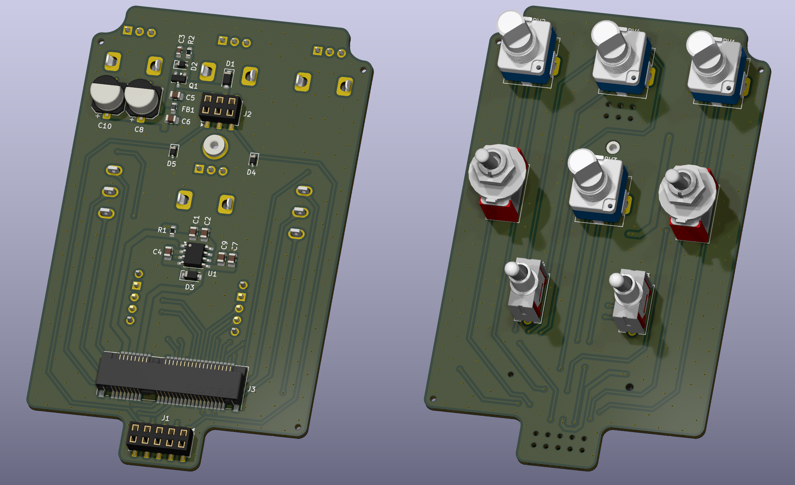

# EFFECTS BASE

Guitar effects platform for interfacing with mini PCIe based boards.

## Introduction

This project consists of a platform with all the controls and signal management for mini PCIe board-based guitar effects.

The platform contains a total of 4 potentiometers and 4 SPDT switches that are accessible throught he mini PCIe connector.

For powering, it offers high filtering and a charge pump in order to produce a negative supply rail.

## Features

 - Mini PCIe connector

- Charge pump inverter

 - 4 potentiometers

 - 4 SPDT switches

 - True bypass
